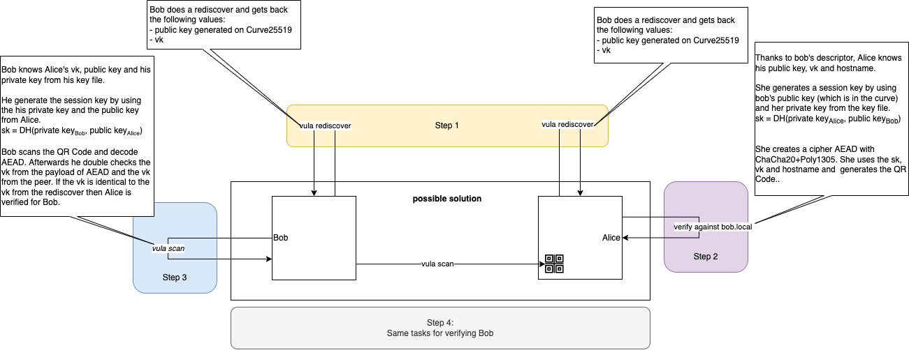

# Design Verify-against
The following picture shows a design which represents the verify-against command: 



## Bob verifies Alice

* Step 1: ```vula rediscover```
* Step 2: ```vula verify against bob.local```
* Step 3: ```vula scan```


