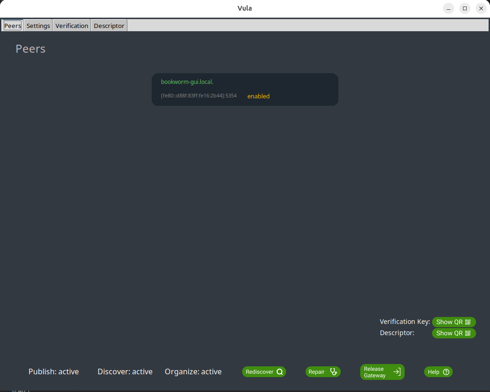
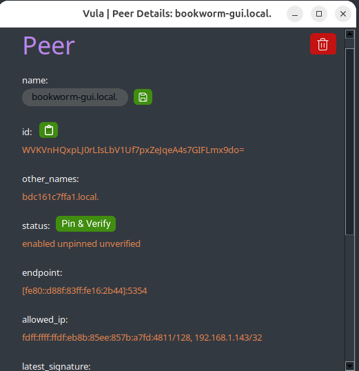
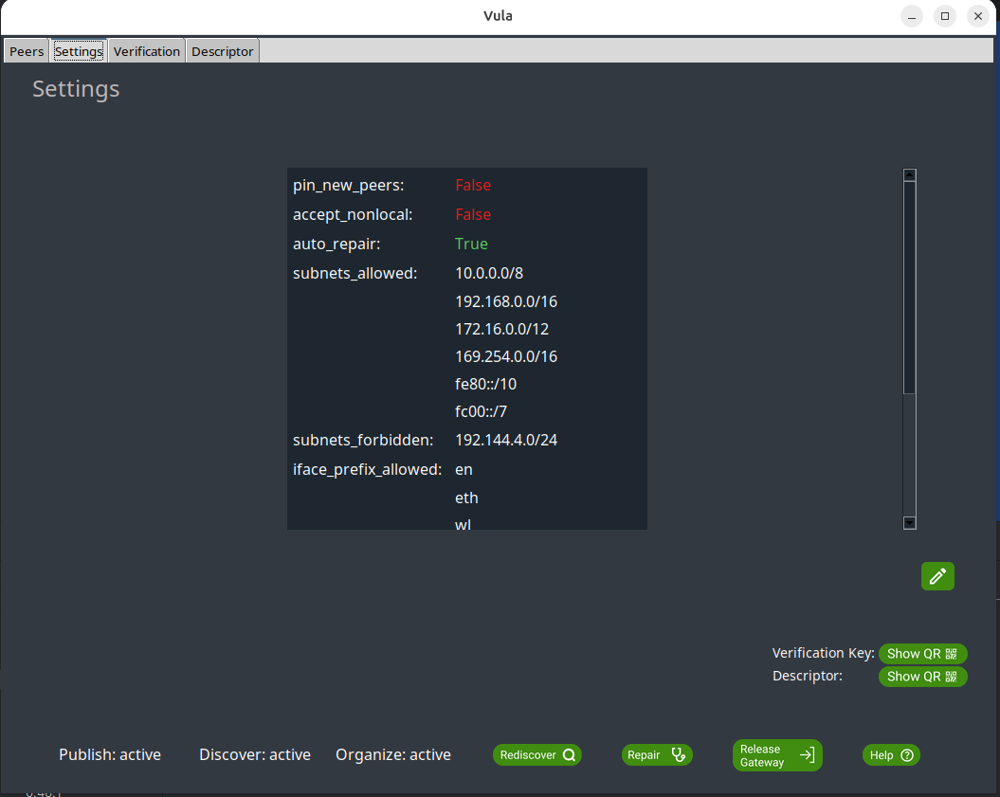
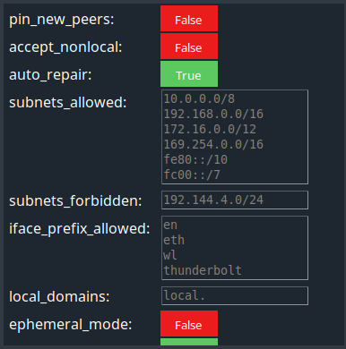
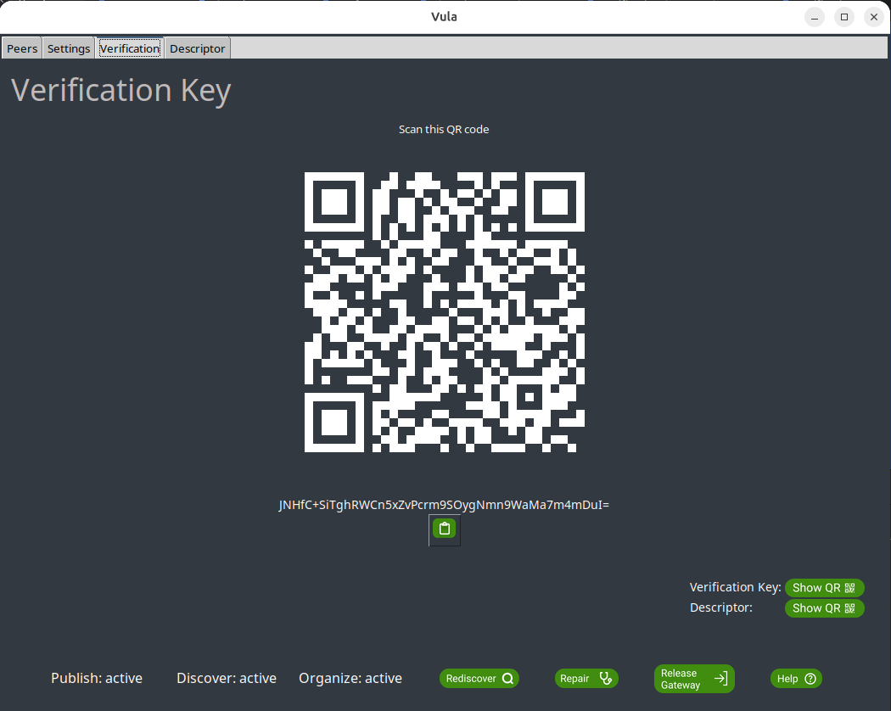
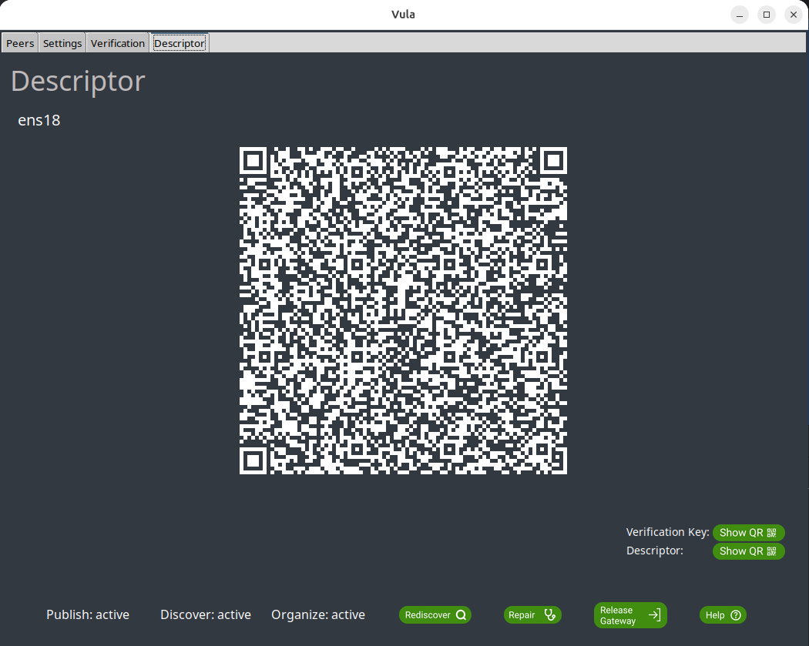

# Vula GUI

A graphical user interface as an alternative to the CLI.

## Features

- **Peer Management**:
  - see connected peers
  - add/remove peers
  - see detailed information of a peer (peer name, peer status, ip address, etc.)
- **Settings**:
  - see currently applied settings
  - alter settings
- **Verification/Descriptor Keys**:
  - Display the verification key as a QR code or copy it as text
  - Show the descriptor QR code
- **Status overview**:
  - see the status of Discover, Publish and Organise in real time

## Views

### Peers
Shows an overview of connected peers and their info.

A peer can be selected for a more detailed overview or to:
- change a peer's name 
- pin and verify a peer 
- delete a peer
- copy a peer's public key 
- adding an IP address to a peer

### Settings
Shows the currently applied settings.

Clicking the edit button allows the user to change those settings.

### Verification
Shows the Verification QR code and the code itself. The code can be copied with the button under it.

### Descriptor
Shows the Descriptor QR code.

## Technical Details

- Built with Python
- Using the Tkinter library and ttk.

## Possible future improvements
- Eliminate all Pop-Out windows and integrate them so that the entire gui runs in one Window.
- Creating a "Template" so that titles, title positions and content can be styled uniformly.
- Consider a single "Overview" page with the possibility to navigate to the designated views for more detail. 
